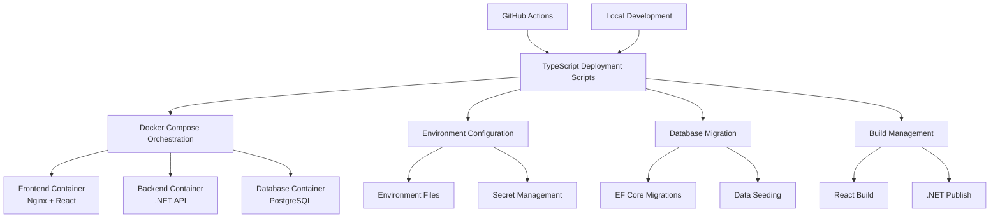

# Design Document

## Overview

The deployment automation system will be built using TypeScript scripts running on Node.js with native TypeScript support (Node.js 20.6+). The system will orchestrate Docker containers, manage environment configurations, handle database migrations, and integrate with GitHub Actions for CI/CD workflows.

## Architecture

### High-Level Architecture



### Project Structure

```
deployment/
├── scripts/
│   ├── deploy.ts              # Main deployment orchestrator
│   ├── build.ts               # Build management
│   ├── database.ts            # Database operations
│   ├── health-check.ts        # Health monitoring
│   ├── config.ts              # Configuration management
│   └── utils/
│       ├── docker.ts          # Docker utilities
│       ├── logger.ts          # Logging utilities
│       └── types.ts           # TypeScript type definitions
├── docker/
│   ├── Dockerfile.frontend    # React app container
│   ├── Dockerfile.backend     # .NET API container
│   ├── nginx.conf             # Nginx configuration
│   └── docker-compose.yml     # Service orchestration
├── environments/
│   ├── development.env
│   ├── staging.env
│   ├── production.env
│   └── local.env
├── github/
│   └── workflows/
│       ├── deploy-production.yml
│       ├── deploy-staging.yml
│       └── pr-preview.yml
├── package.json               # Node.js dependencies
├── tsconfig.json             # TypeScript configuration
└── README.md                 # Documentation
```

## Components and Interfaces

### 1. Core Deployment Interface

```typescript
interface DeploymentConfig {
  environment: 'development' | 'staging' | 'production' | 'local';
  services: ServiceConfig[];
  database: DatabaseConfig;
  build: BuildConfig;
  healthChecks: HealthCheckConfig[];
}

interface ServiceConfig {
  name: string;
  image: string;
  ports: PortMapping[];
  environment: Record<string, string>;
  volumes: VolumeMapping[];
  healthCheck?: HealthCheckConfig;
}
```

### 2. Build Management System

```typescript
class BuildManager {
  async buildFrontend(config: BuildConfig): Promise<BuildResult>
  async buildBackend(config: BuildConfig): Promise<BuildResult>
  async createDockerImages(services: ServiceConfig[]): Promise<ImageResult[]>
  async optimizeAssets(): Promise<void>
}
```

### 3. Database Migration System

```typescript
class DatabaseManager {
  async initializeDatabase(config: DatabaseConfig): Promise<void>
  async runMigrations(): Promise<MigrationResult[]>
  async seedData(seedFiles: string[]): Promise<void>
  async createBackup(): Promise<BackupResult>
  async restoreBackup(backupPath: string): Promise<void>
}
```

### 4. Environment Configuration Manager

```typescript
class ConfigManager {
  async loadEnvironment(env: string): Promise<EnvironmentConfig>
  async validateConfig(config: EnvironmentConfig): Promise<ValidationResult>
  async injectSecrets(config: EnvironmentConfig): Promise<EnvironmentConfig>
  async generateDockerComposeFile(config: DeploymentConfig): Promise<string>
}
```

### 5. Health Check System

```typescript
class HealthChecker {
  async checkService(service: ServiceConfig): Promise<HealthStatus>
  async waitForHealthy(services: ServiceConfig[], timeout: number): Promise<boolean>
  async performRollback(previousVersion: string): Promise<void>
}
```

## Data Models

### Configuration Schema

```typescript
interface EnvironmentConfig {
  database: {
    host: string;
    port: number;
    name: string;
    username: string;
    password: string;
  };
  api: {
    port: number;
    jwtSecret: string;
    corsOrigins: string[];
  };
  frontend: {
    apiUrl: string;
    port: number;
  };
  docker: {
    registry?: string;
    namespace: string;
    tag: string;
  };
}
```

### Build Configuration

```typescript
interface BuildConfig {
  frontend: {
    outputDir: string;
    publicPath: string;
    optimization: boolean;
    sourceMaps: boolean;
  };
  backend: {
    configuration: 'Debug' | 'Release';
    outputDir: string;
    selfContained: boolean;
  };
  docker: {
    buildArgs: Record<string, string>;
    labels: Record<string, string>;
  };
}
```

## Error Handling

### Error Types

```typescript
abstract class DeploymentError extends Error {
  abstract readonly code: string;
  abstract readonly recoverable: boolean;
}

class BuildError extends DeploymentError {
  readonly code = 'BUILD_FAILED';
  readonly recoverable = true;
}

class DatabaseError extends DeploymentError {
  readonly code = 'DATABASE_ERROR';
  readonly recoverable = false;
}

class HealthCheckError extends DeploymentError {
  readonly code = 'HEALTH_CHECK_FAILED';
  readonly recoverable = true;
}
```

### Error Recovery Strategy

1. **Build Failures**: Retry with clean cache, report detailed error logs
2. **Database Errors**: Attempt rollback, preserve data integrity
3. **Health Check Failures**: Automatic rollback to previous version
4. **Network Issues**: Retry with exponential backoff
5. **Configuration Errors**: Validate before deployment, fail fast

## Testing Strategy

### Unit Testing

```typescript
// Example test structure
describe('DeploymentManager', () => {
  describe('deploy', () => {
    it('should successfully deploy to staging environment', async () => {
      const config = await loadTestConfig('staging');
      const result = await deploymentManager.deploy(config);
      expect(result.success).toBe(true);
    });
    
    it('should rollback on health check failure', async () => {
      const config = await loadTestConfig('staging');
      mockHealthCheck.mockRejectedValue(new HealthCheckError('Service unhealthy'));
      
      await expect(deploymentManager.deploy(config)).rejects.toThrow();
      expect(rollbackSpy).toHaveBeenCalled();
    });
  });
});
```

### Integration Testing

1. **Docker Compose Validation**: Test complete stack deployment
2. **Database Migration Testing**: Test migration scripts with test data
3. **Health Check Integration**: Verify all services respond correctly
4. **Environment Configuration**: Test all environment configurations
5. **GitHub Actions Simulation**: Test CI/CD workflows locally

### End-to-End Testing

1. **Full Deployment Cycle**: Deploy, test, rollback scenarios
2. **Multi-Environment Testing**: Test deployment to different environments
3. **Performance Testing**: Measure deployment time and resource usage
4. **Disaster Recovery**: Test backup and restore procedures

## Security Considerations

### Secret Management

```typescript
class SecretManager {
  async loadSecrets(environment: string): Promise<Record<string, string>> {
    // Load from secure vault or environment variables
    // Never log or expose secrets in plain text
  }
  
  async injectSecrets(config: any): Promise<any> {
    // Replace placeholder values with actual secrets
    // Ensure secrets are not persisted in configuration files
  }
}
```

### Container Security

1. **Non-root Users**: All containers run with non-privileged users
2. **Minimal Base Images**: Use Alpine or distroless images
3. **Security Scanning**: Automated vulnerability scanning
4. **Network Policies**: Restrict inter-container communication
5. **Resource Limits**: Set CPU and memory limits

### Access Control

1. **GitHub Actions Secrets**: Store sensitive data in GitHub secrets
2. **Environment Isolation**: Separate credentials for each environment
3. **Audit Logging**: Log all deployment activities
4. **Role-based Access**: Restrict deployment permissions
5. **Secure Communication**: Use HTTPS/TLS for all communications

## Performance Optimization

### Build Optimization

1. **Multi-stage Docker Builds**: Minimize final image size
2. **Build Caching**: Cache dependencies and intermediate layers
3. **Parallel Builds**: Build frontend and backend simultaneously
4. **Asset Optimization**: Compress and optimize static assets

### Deployment Optimization

1. **Rolling Updates**: Zero-downtime deployments
2. **Health Check Optimization**: Fast and reliable health checks
3. **Resource Management**: Optimal CPU and memory allocation
4. **Network Optimization**: Minimize network latency

### Monitoring and Metrics

1. **Deployment Time Tracking**: Monitor deployment duration
2. **Resource Usage Monitoring**: Track CPU, memory, disk usage
3. **Error Rate Monitoring**: Track deployment success/failure rates
4. **Performance Metrics**: Monitor application performance post-deployment