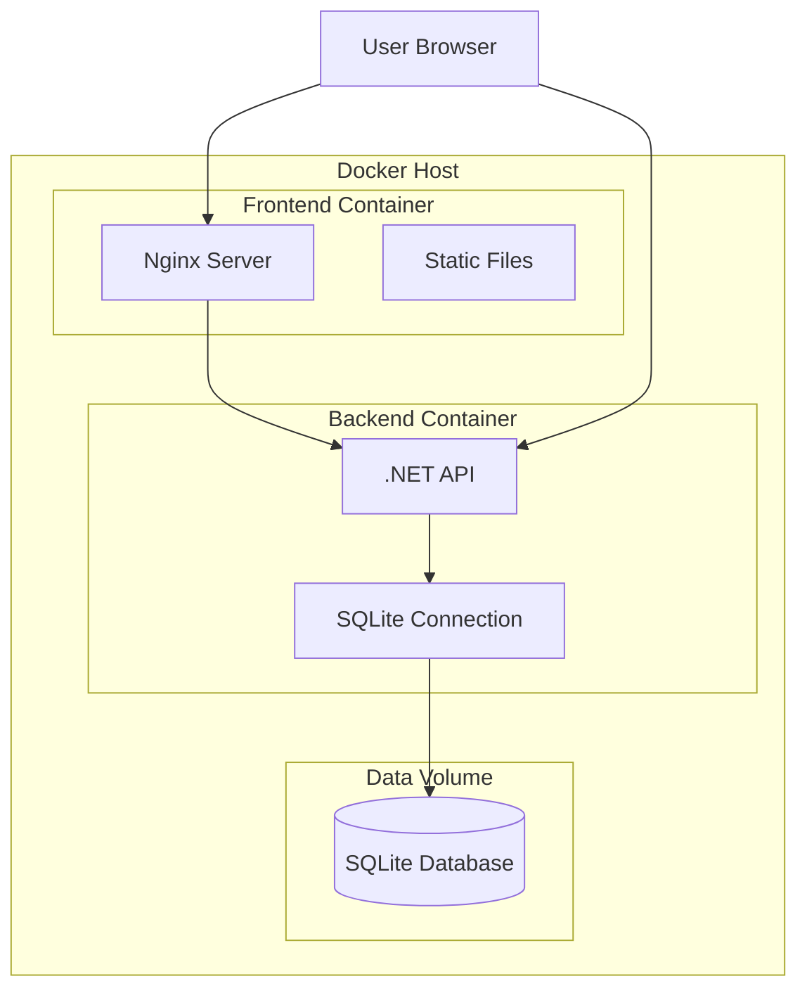

# Design Document

## Overview

Данный дизайн описывает минимально необходимую Docker-инфраструктуру для запуска GeoQuiz приложения. Система состоит из трех основных компонентов: контейнеризованного React фронтенда, .NET 10 бэкенда и персистентного хранилища для SQLite базы данных. Все компоненты оркестрируются через Docker Compose для обеспечения простого развертывания одной командой.

## Architecture

### High-Level Architecture



### Container Communication

- **Frontend → Backend**: HTTP API calls через внутреннюю Docker сеть
- **Backend → Database**: Прямое подключение к SQLite файлу через volume mount
- **External Access**: Только фронтенд экспонируется наружу (порт 80), бэкенд доступен через proxy

## Components and Interfaces

### 1. Frontend Container (nginx-frontend)

**Base Image**: `nginx:alpine`
**Build Strategy**: Multi-stage build

#### Build Stage 1: React Application Build
- **Base**: `node:alpine`
- **Purpose**: Компиляция React приложения в статические файлы
- **Process**:
  1. Копирование package.json и package-lock.json
  2. Установка зависимостей (`npm ci`)
  3. Копирование исходного кода
  4. Сборка production build (`npm run build`)

#### Build Stage 2: Nginx Server
- **Base**: `nginx:alpine`
- **Purpose**: Обслуживание статических файлов и проксирование API
- **Configuration**:
  - Копирование build файлов из первого stage
  - Настройка nginx.conf для SPA routing
  - Проксирование `/api/*` запросов к бэкенд контейнеру

#### Nginx Configuration
```nginx
server {
    listen 80;
    server_name localhost;
    root /usr/share/nginx/html;
    index index.html;

    # SPA routing support
    location / {
        try_files $uri $uri/ /index.html;
    }

    # API proxy
    location /api/ {
        proxy_pass http://backend:5000/api/;
        proxy_set_header Host $host;
        proxy_set_header X-Real-IP $remote_addr;
        proxy_set_header X-Forwarded-For $proxy_add_x_forwarded_for;
        proxy_set_header X-Forwarded-Proto $scheme;
    }
}
```

### 2. Backend Container (dotnet-backend)

**Base Image**: `mcr.microsoft.com/dotnet/aspnet:10.0`
**Build Strategy**: Multi-stage build

#### Build Stage 1: .NET Application Build
- **Base**: `mcr.microsoft.com/dotnet/sdk:10.0`
- **Purpose**: Компиляция .NET приложения
- **Process**:
  1. Копирование .csproj файла
  2. Восстановление NuGet пакетов (`dotnet restore`)
  3. Копирование исходного кода
  4. Публикация приложения (`dotnet publish -c Release`)

#### Build Stage 2: Runtime Container
- **Base**: `mcr.microsoft.com/dotnet/aspnet:10.0`
- **Purpose**: Выполнение скомпилированного приложения
- **Configuration**:
  - Копирование опубликованного приложения
  - Настройка рабочей директории
  - Экспонирование порта 5000
  - Настройка переменных окружения

#### Environment Variables
- `ASPNETCORE_ENVIRONMENT=Production`
- `ASPNETCORE_URLS=http://+:5000`
- `ConnectionStrings__DefaultConnection=Data Source=/app/data/geoquiz.db`

### 3. Database Volume (sqlite-data)

**Type**: Named Docker Volume
**Mount Point**: `/app/data` в backend контейнере
**Purpose**: Персистентное хранение SQLite базы данных

#### Volume Configuration
- **Name**: `geoquiz-sqlite-data`
- **Driver**: local
- **Backup Strategy**: Volume может быть скопирован для резервного копирования

## Data Models

### Docker Compose Services

```yaml
services:
  frontend:
    build:
      context: .
      dockerfile: Dockerfile.frontend
    ports:
      - "80:80"
    depends_on:
      - backend
    networks:
      - geoquiz-network

  backend:
    build:
      context: ./backend/GeoQuizApi
      dockerfile: Dockerfile
    expose:
      - "5000"
    volumes:
      - sqlite-data:/app/data
    environment:
      - ASPNETCORE_ENVIRONMENT=Production
      - ASPNETCORE_URLS=http://+:5000
      - ConnectionStrings__DefaultConnection=Data Source=/app/data/geoquiz.db
    networks:
      - geoquiz-network

volumes:
  sqlite-data:
    driver: local

networks:
  geoquiz-network:
    driver: bridge
```

### Environment Configuration

#### Frontend Environment Variables
- `VITE_API_URL=/api` (относительный путь для проксирования)
- `VITE_ENVIRONMENT=production`
- `VITE_DEBUG=false`

#### Backend Environment Variables
- `ASPNETCORE_ENVIRONMENT=Production`
- `ASPNETCORE_URLS=http://+:5000`
- `ConnectionStrings__DefaultConnection=Data Source=/app/data/geoquiz.db`
- `JwtSettings__SecretKey` (из переменной окружения)

## Error Handling

### Build-time Error Handling

1. **Frontend Build Failures**:
   - Проверка наличия package.json
   - Валидация TypeScript кода
   - Обработка ошибок сборки Vite

2. **Backend Build Failures**:
   - Проверка .NET SDK версии
   - Валидация NuGet пакетов
   - Обработка ошибок компиляции

### Runtime Error Handling

1. **Container Startup**:
   - Health checks для проверки готовности сервисов
   - Retry механизмы для подключения к базе данных
   - Graceful shutdown обработка

2. **Database Initialization**:
   - Автоматическое создание базы данных при первом запуске
   - Применение Entity Framework миграций
   - Создание тестовых данных в development режиме

3. **Network Communication**:
   - Timeout настройки для API calls
   - Retry логика для временных сбоев
   - Proper error responses от nginx proxy

## Testing Strategy

### Container Testing

1. **Build Testing**:
   - Проверка успешной сборки всех образов
   - Валидация размеров образов
   - Тестирование multi-stage builds

2. **Integration Testing**:
   - Проверка связности между контейнерами
   - Тестирование API endpoints через nginx proxy
   - Валидация database persistence

3. **Health Checks**:
   ```yaml
   healthcheck:
     test: ["CMD", "curl", "-f", "http://localhost:5000/health"]
     interval: 30s
     timeout: 10s
     retries: 3
     start_period: 40s
   ```

### Development Testing

1. **Local Development**:
   - Volume mounting для live reload
   - Debug режим для детального логирования
   - Доступ к database файлу для инспекции

2. **CI/CD Integration**:
   - Automated build testing
   - Container security scanning
   - Performance benchmarking

## Security Considerations

### Container Security

1. **Non-root Users**:
   - Frontend: nginx runs as nginx user
   - Backend: создание dedicated user для .NET приложения

2. **Minimal Base Images**:
   - Использование alpine образов где возможно
   - Удаление build dependencies в production образах

3. **Network Security**:
   - Изолированная Docker сеть
   - Экспонирование только необходимых портов
   - Proper CORS configuration

### Data Security

1. **Database Access**:
   - SQLite файл доступен только backend контейнеру
   - Volume permissions настроены корректно

2. **Secrets Management**:
   - JWT secrets через environment variables
   - Возможность использования Docker secrets

## Performance Optimization

### Build Optimization

1. **Layer Caching**:
   - Оптимальный порядок COPY команд
   - Использование .dockerignore файлов
   - Multi-stage builds для минимизации размера

2. **Dependency Management**:
   - Кэширование npm и NuGet пакетов
   - Использование package-lock.json для консистентности

### Runtime Optimization

1. **Resource Limits**:
   ```yaml
   deploy:
     resources:
       limits:
         memory: 512M
         cpus: '0.5'
       reservations:
         memory: 256M
         cpus: '0.25'
   ```

2. **Nginx Optimization**:
   - Gzip compression для статических файлов
   - Proper caching headers
   - Connection pooling для API proxy

## Deployment Workflow

### Development Deployment

1. **Prerequisites**:
   - Docker и Docker Compose установлены
   - Порты 80 и 5000 свободны

2. **Deployment Steps**:
   ```bash
   # Clone repository
   git clone <repository>
   cd <project-directory>
   
   # Start services
   docker compose up --build
   
   # Access application
   open http://localhost
   ```

### Production Considerations

1. **Environment Variables**:
   - Создание production .env файла
   - Настройка JWT secrets
   - Конфигурация CORS origins

2. **Monitoring**:
   - Health check endpoints
   - Log aggregation
   - Performance metrics

3. **Backup Strategy**:
   - Regular volume backups
   - Database export procedures
   - Disaster recovery plan