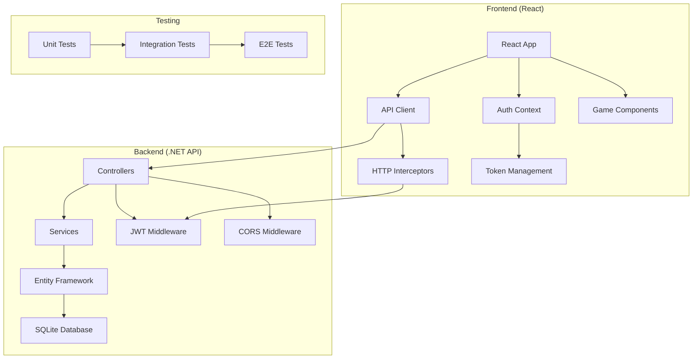

# Дизайн интеграции фронтенда и бекенда

## Обзор

Данный документ описывает архитектурное решение для интеграции React фронтенда с .NET API бекендом приложения GeoQuiz. Интеграция включает в себя создание типизированного API клиента, обновление сервисов аутентификации, реализацию сохранения прогресса игр, отображение статистики и лидербордов, а также комплексное тестирование всех интеграционных точек.

## Архитектура

### Общая архитектура системы



### Слои интеграции

1. **API Client Layer** - Типизированный HTTP клиент с автоматическим управлением токенами
2. **Authentication Layer** - Обновленная система аутентификации с интеграцией бекенда
3. **Game Progress Layer** - Сервис для сохранения и синхронизации прогресса игр
4. **Statistics Layer** - Отображение пользовательской статистики и лидербордов
5. **Error Handling Layer** - Централизованная обработка ошибок и состояний загрузки

## Компоненты и интерфейсы

### 1. Анализ существующей реализации

**Уже реализовано:**
- ✅ **AuthService** с полной функциональностью (login, register, refreshToken, logout, getCurrentUser, updateProfile, changePassword)
- ✅ **HttpClient** с автоматическим управлением токенами и обработкой ошибок
- ✅ **TokenManager** с безопасным хранением и автоматическим обновлением токенов
- ✅ **ValidationUtils** для клиентской валидации
- ✅ **AuthContext** с полным управлением состоянием аутентификации
- ✅ **OAuth2Service** для социальной аутентификации
- ✅ **GameProgressService** с локальным сохранением и синхронизацией

**Требует обновления:**
- 🔄 **API Base URL** - изменить с `http://localhost:3001/api` на правильный URL бекенда
- 🔄 **API Endpoints** - обновить пути эндпоинтов для соответствия .NET API
- 🔄 **Response Types** - добавить типы для соответствия .NET API ответам
- 🔄 **GameProgressService** - интегрировать с реальным API вместо localStorage

### 2. Необходимые изменения в существующих сервисах

#### Обновление API Configuration
```typescript
// Изменить в AuthService.ts и OAuth2Service.ts
const API_BASE_URL = process.env.REACT_APP_API_URL || 'http://localhost:5000/api'
```

#### Обновление API Endpoints
```typescript
// Текущие эндпоинты -> Новые эндпоинты (.NET API)
'/auth/register' -> '/auth/register' ✅ (совпадает)
'/auth/login' -> '/auth/login' ✅ (совпадает)  
'/auth/refresh' -> '/auth/refresh' ✅ (совпадает)
'/auth/me' -> '/auth/me' ✅ (совпадает)
'/auth/profile' -> '/auth/profile' ✅ (совпадает)
'/auth/change-password' -> '/auth/change-password' ✅ (совпадает)
```

#### Добавление новых API сервисов
```typescript
class GameStatsApiService {
  private httpClient: typeof HttpClient
  
  async saveGameSession(session: GameSessionRequest): Promise<GameSessionDto>
  async getUserStats(): Promise<GameStatsResponse>  
  async getUserGameHistory(page: number, pageSize: number): Promise<GameHistoryResponse>
  async migrateAnonymousProgress(sessions: AnonymousGameSession[]): Promise<void>
}

class LeaderboardApiService {
  private httpClient: typeof HttpClient
  
  async getGlobalLeaderboard(page: number, pageSize: number): Promise<LeaderboardResponse>
  async getLeaderboardByGameType(gameType: string, page: number, pageSize: number): Promise<LeaderboardResponse>
  async getLeaderboardByPeriod(period: string, page: number, pageSize: number): Promise<LeaderboardResponse>
}
```

### 3. Обновление GameProgressService

**Текущая реализация:** Использует localStorage для хранения прогресса
**Требуемые изменения:** Интеграция с .NET API

```typescript
// Обновить существующий GameProgressService
class GameProgressService {
  private readonly httpClient = HttpClient // Использовать существующий HttpClient
  
  // Обновить методы для работы с API
  async saveGameProgress(userId: string, gameType: GameType, session: GameSession): Promise<void> {
    const sessionRequest: GameSessionRequest = {
      gameType,
      correctAnswers: session.correctAnswers,
      wrongAnswers: session.wrongAnswers,
      sessionStartTime: session.sessionStartTime.toISOString(),
      sessionEndTime: session.sessionEndTime?.toISOString() || new Date().toISOString()
    }
    
    try {
      const token = TokenManager.getAccessToken()
      await this.httpClient.post<GameSessionDto>('/game-stats', sessionRequest, token)
    } catch (error) {
      // Fallback to localStorage if API fails
      await this.saveGameProgressLocally(userId, gameType, session)
      throw error
    }
  }
  
  // Сохранить существующие методы как fallback
  private async saveGameProgressLocally(userId: string, gameType: GameType, session: GameSession): Promise<void> {
    // Существующая логика localStorage
  }
}
```

### 4. Новый LeaderboardService

**Новый сервис** (не существует в текущей реализации)

```typescript
class LeaderboardService {
  private readonly httpClient = HttpClient
  private cache = new Map<string, { data: LeaderboardResponse; timestamp: number }>()
  private readonly CACHE_TTL = 5 * 60 * 1000 // 5 minutes
  
  async getGlobalLeaderboard(page: number = 1, pageSize: number = 50): Promise<LeaderboardResponse> {
    const cacheKey = `global_${page}_${pageSize}`
    const cached = this.getCachedData(cacheKey)
    if (cached) return cached
    
    try {
      const token = TokenManager.getAccessToken()
      const response = await this.httpClient.get<LeaderboardResponse>(
        `/leaderboard?page=${page}&pageSize=${pageSize}`, 
        token
      )
      this.setCachedData(cacheKey, response)
      return response
    } catch (error) {
      console.error('Failed to fetch global leaderboard:', error)
      throw error
    }
  }
  
  // Аналогичные методы для других типов лидербордов
}
```

### 5. Дополнительные типы данных

**Требуется добавить** типы для соответствия .NET API

```typescript
// Добавить в types.ts
interface GameSessionRequest {
  gameType: string
  correctAnswers: number
  wrongAnswers: number
  sessionStartTime: string
  sessionEndTime: string
}

interface GameSessionDto {
  id: string
  gameType: string
  correctAnswers: number
  wrongAnswers: number
  accuracy: number
  sessionStartTime: string
  sessionEndTime: string
  sessionDurationMs: number
  createdAt: string
}

interface GameStatsResponse {
  totalGames: number
  totalCorrectAnswers: number
  totalWrongAnswers: number
  bestStreak: number
  averageAccuracy: number
  lastPlayedAt?: string
  gameTypeStats: Record<string, GameTypeStatsDto>
}

interface GameTypeStatsDto {
  games: number
  correctAnswers: number
  wrongAnswers: number
  accuracy: number
  bestStreak: number
}

interface LeaderboardResponse {
  players: LeaderboardEntryDto[]
  totalPlayers: number
  page: number
  pageSize: number
  hasNextPage: boolean
  currentUserRank?: number
}

interface LeaderboardEntryDto {
  rank: number
  userId: string
  userName: string
  userAvatar?: string
  totalScore: number
  accuracy: number
  gamesPlayed: number
  isCurrentUser: boolean
}
```

### 6. Обработка ошибок (уже реализована)

**Существующая реализация:**
- ✅ **AuthServiceError** класс с типизированными ошибками
- ✅ **AuthErrorType** enum с различными типами ошибок  
- ✅ **HttpClient** с автоматической обработкой HTTP ошибок
- ✅ **AuthContext** с состоянием ошибок в UI

**Дополнительно требуется:**
- 🔄 Расширить типы ошибок для новых API сервисов

## Модели данных

### API Request/Response Types

#### Authentication
```typescript
interface LoginRequest {
  email: string
  password: string
}

interface RegisterRequest {
  email: string
  password: string
  name?: string
}

interface AuthResponse {
  user: UserDto
  accessToken: string
  refreshToken: string
  expiresIn: number
}

interface UserDto {
  id: string
  email: string
  name?: string
  avatar?: string
  provider: string
  createdAt: string
  lastLoginAt?: string
}
```

#### Game Statistics
```typescript
interface GameSessionRequest {
  gameType: string
  correctAnswers: number
  wrongAnswers: number
  sessionStartTime: string
  sessionEndTime: string
}

interface GameStatsResponse {
  totalGames: number
  totalCorrectAnswers: number
  totalWrongAnswers: number
  bestStreak: number
  averageAccuracy: number
  lastPlayedAt?: string
  gameTypeStats: Record<string, GameTypeStatsDto>
}

interface GameHistoryResponse {
  sessions: GameSessionDto[]
  totalCount: number
  page: number
  pageSize: number
  hasNextPage: boolean
}
```

#### Leaderboard
```typescript
interface LeaderboardResponse {
  players: LeaderboardEntryDto[]
  totalPlayers: number
  page: number
  pageSize: number
  hasNextPage: boolean
  currentUserRank?: number
}

interface LeaderboardEntryDto {
  rank: number
  userId: string
  userName: string
  userAvatar?: string
  totalScore: number
  accuracy: number
  gamesPlayed: number
  isCurrentUser: boolean
}
```

## Обработка ошибок

### Типы ошибок
```typescript
enum ApiErrorType {
  NETWORK_ERROR = 'NETWORK_ERROR',
  AUTHENTICATION_ERROR = 'AUTHENTICATION_ERROR',
  VALIDATION_ERROR = 'VALIDATION_ERROR',
  SERVER_ERROR = 'SERVER_ERROR',
  TIMEOUT_ERROR = 'TIMEOUT_ERROR'
}

interface ApiError {
  type: ApiErrorType
  message: string
  statusCode?: number
  details?: any
  timestamp: Date
}
```

### Error Recovery Strategies
1. **Automatic Retry**: Для сетевых ошибок с экспоненциальной задержкой
2. **Token Refresh**: Автоматическое обновление токенов при 401 ошибках
3. **Offline Mode**: Переключение в офлайн режим при недоступности сервера
4. **User Notification**: Показ понятных сообщений пользователю

## Стратегия тестирования

### Unit Tests
- **API Client**: Тестирование HTTP запросов и обработки ошибок
- **Services**: Тестирование бизнес-логики сервисов
- **Components**: Тестирование React компонентов с мокированными API вызовами

### Integration Tests
- **Authentication Flow**: Полный цикл аутентификации
- **Game Progress**: Сохранение и загрузка прогресса игр
- **Leaderboard**: Получение и отображение лидербордов
- **Error Handling**: Обработка различных типов ошибок

### End-to-End Tests
- **User Registration/Login**: Полный пользовательский сценарий
- **Game Session**: Игра с сохранением результатов
- **Profile Management**: Обновление профиля пользователя
- **Offline/Online Sync**: Синхронизация данных

### API Contract Tests
- **Schema Validation**: Проверка соответствия API схемам
- **Backward Compatibility**: Тестирование совместимости версий API
- **Performance Tests**: Нагрузочное тестирование API эндпоинтов

## Конфигурация и развертывание

### Environment Configuration
```typescript
interface ApiConfig {
  baseURL: string
  timeout: number
  retryAttempts: number
  retryDelay: number
  enableLogging: boolean
}

// Development
const devConfig: ApiConfig = {
  baseURL: 'http://localhost:5000/api',
  timeout: 10000,
  retryAttempts: 3,
  retryDelay: 1000,
  enableLogging: true
}

// Production
const prodConfig: ApiConfig = {
  baseURL: 'https://api.geoquiz.com/api',
  timeout: 15000,
  retryAttempts: 2,
  retryDelay: 2000,
  enableLogging: false
}
```

### CORS Configuration
```json
{
  "CorsSettings": {
    "AllowedOrigins": [
      "http://localhost:3000",
      "https://geoquiz.com"
    ],
    "AllowCredentials": true,
    "AllowedHeaders": [
      "Content-Type",
      "Authorization"
    ],
    "AllowedMethods": [
      "GET", "POST", "PUT", "DELETE"
    ]
  }
}
```

## Безопасность

### Token Security
- **Secure Storage**: Использование httpOnly cookies для refresh токенов
- **Token Rotation**: Автоматическая ротация токенов
- **XSS Protection**: Защита от XSS атак через CSP заголовки

### API Security
- **Rate Limiting**: Ограничение количества запросов
- **Input Validation**: Валидация всех входящих данных
- **HTTPS Only**: Принудительное использование HTTPS в продакшене

### Data Privacy
- **Minimal Data**: Передача только необходимых данных
- **Data Encryption**: Шифрование чувствительных данных
- **Audit Logging**: Логирование всех операций с пользовательскими данными

## Производительность

### Caching Strategy
- **API Response Caching**: Кеширование ответов API на клиенте
- **Leaderboard Caching**: Серверное кеширование лидербордов
- **Static Data Caching**: Кеширование статических данных (страны, флаги)

### Optimization Techniques
- **Request Batching**: Группировка множественных запросов
- **Lazy Loading**: Ленивая загрузка данных
- **Pagination**: Пагинация для больших наборов данных
- **Compression**: Сжатие HTTP ответов

### Monitoring
- **Performance Metrics**: Мониторинг времени ответа API
- **Error Tracking**: Отслеживание и анализ ошибок
- **User Analytics**: Аналитика использования приложения