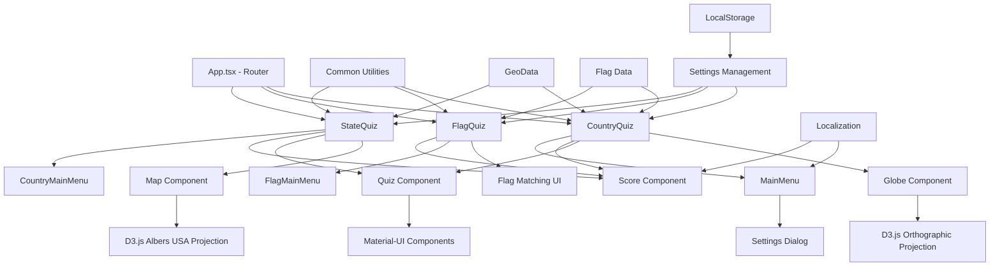

# Design Document

## Overview

The React + D3.js Geo Quiz application is a client-side educational platform built with modern web technologies. The application provides three distinct quiz modes for geography learning: Country Quiz with interactive 3D globe visualization, Flag Quiz with matching gameplay, and State Quiz focusing on US geography. The architecture follows React component-based design patterns with D3.js for data visualization, Material-UI for consistent UI components, and TypeScript for type safety.

## Architecture

### High-Level Architecture



### Component Architecture

The application follows a hierarchical component structure:

**Top Level:**
- `App.tsx` - Main application router using React Router DOM
- Route-based quiz components (CountryQuiz, FlagQuiz, StateQuiz)

**Shared Components:**
- `Quiz.tsx` - Reusable quiz interface with multiple choice buttons
- `Score.tsx` - Score display component used across all quiz modes
- `MainMenu.tsx` - Settings and navigation menu

**Specialized Components:**
- `Globe.tsx` - D3.js-powered interactive 3D globe visualization
- `Map.tsx` - D3.js-powered US states map visualization
- Flag matching interface (embedded in FlagQuiz.tsx)

## Components and Interfaces

### Core Quiz Components

#### CountryQuiz Component
- **Purpose**: Interactive geography quiz with 3D globe visualization
- **Key Features**: 
  - D3.js orthographic projection for 3D globe effect
  - Country highlighting and selection
  - Difficulty-based region filtering
  - Pin markers for small countries
- **State Management**: 
  - Quiz options and correct answers
  - Score tracking (correct/wrong)
  - UI interaction states (disabled during feedback)
- **Integration**: Uses Globe, Quiz, Score, and MainMenu components

#### FlagQuiz Component
- **Purpose**: Flag-to-country matching game
- **Key Features**:
  - Drag-and-drop style matching interface
  - Visual feedback for correct/incorrect matches
  - Batch processing of 5 flag-country pairs
- **State Management**:
  - Selected flags and countries
  - Match validation and error states
  - Progress tracking through match completion
- **UI Pattern**: Two-column layout with flags and country names

#### StateQuiz Component
- **Purpose**: US states identification quiz
- **Key Features**:
  - D3.js Albers USA projection for accurate US map
  - State highlighting and zoom functionality
  - Automatic centering on selected states
- **Integration**: Uses Map, Quiz, and Score components

### Visualization Components

#### Globe Component
- **Technology**: D3.js with orthographic projection
- **Features**:
  - Interactive rotation via drag gestures
  - Zoom functionality with scale constraints
  - Country highlighting based on selection
  - Pin markers for small countries using label coordinates
  - Optional border display
  - Automatic centering on selected countries
- **Performance**: Efficient re-rendering on country selection changes
- **Customization**: Configurable colors, borders, pins, and zoom controls

#### Map Component  
- **Technology**: D3.js with Albers USA projection
- **Features**:
  - US-specific geographic projection
  - State highlighting and selection
  - Zoom and pan functionality
  - Automatic bounds calculation and centering
- **Integration**: Optimized for US geography quiz requirements

### Shared UI Components

#### Quiz Component
- **Purpose**: Reusable multiple-choice interface
- **Features**:
  - Configurable option display (with/without flags)
  - Visual feedback system (success/error styling)
  - Disabled state during answer processing
  - Material-UI integration for consistent styling
- **Flexibility**: Supports both text-only and flag-enhanced options

#### Score Component
- **Purpose**: Real-time score display
- **Features**:
  - Localized text support
  - Separate correct/incorrect counters
  - Consistent styling across quiz modes
- **Integration**: Used by all quiz components

## Data Models

### Geographic Data Structure

```typescript
// GeoJSON Feature Structure
interface GeoFeature {
  type: "Feature"
  properties: {
    name: string           // Country name (English)
    name_en: string        // English name
    name_ru: string        // Russian name
    iso_a2: string         // ISO country code
    type: string           // Country type classification
    continent: string      // Continent classification
    region_un: string      // UN region
    subregion: string      // Geographic subregion
    region_wb: string      // World Bank region
    label_x?: number       // Label coordinate X (for small countries)
    label_y?: number       // Label coordinate Y (for small countries)
  }
  geometry: GeoJSON.Geometry
}
```

### Application Data Models

```typescript
// Quiz Option Structure
interface CountryOption {
  code: string           // Flag code or state abbreviation
  name: string          // Display name
  translatedName: string // Localized name
}

// Settings Configuration
interface CountryQuizSettings {
  language: 'en' | 'ru'
  showPin: boolean
  difficulty: 'easy' | 'medium' | 'hard'
  showZoomButtons: boolean
  showBorders: boolean
  showSovereignCountries: boolean
  showDisputed: boolean
  showOthers: boolean
}

// Flag Data Structure
interface CountryFlagData {
  code: string          // ISO country code for flag URL
  name: string          // Country name (English)
  name_ru?: string      // Country name (Russian)
}
```

### Data Sources

**Geographic Data:**
- `geo.json` - World countries GeoJSON with comprehensive metadata
- `us.json` - US states GeoJSON with state-specific properties
- `countryCodes2.json` - Flag code mappings and country names

**External Resources:**
- Flag images via `flagcdn.com` CDN using ISO country codes
- Map pin SVG from public assets

## Error Handling

### Data Validation
- **Missing Geographic Data**: Graceful fallback when country properties are undefined
- **Flag Code Matching**: Multiple fallback strategies for flag-country association
- **Small Country Handling**: Label coordinate validation before pin placement

### User Interface
- **Loading States**: "Loading..." display while geographic data initializes
- **Network Failures**: Graceful degradation when flag images fail to load
- **Invalid Selections**: Prevention of interaction with disabled or matched elements

### Geographic Edge Cases
- **Region Filtering**: Automatic fallback to broader regions when insufficient countries
- **Projection Boundaries**: Proper handling of countries outside projection bounds
- **Coordinate Systems**: Validation of geographic coordinates before projection

## Testing Strategy

### Component Testing
- **Unit Tests**: Individual component functionality and state management
- **Integration Tests**: Component interaction and data flow validation
- **Visual Tests**: D3.js rendering and interaction behavior

### Geographic Data Testing
- **Data Integrity**: Validation of GeoJSON structure and required properties
- **Projection Testing**: Coordinate transformation accuracy
- **Country Matching**: Flag-country association validation

### User Experience Testing
- **Interaction Testing**: Drag, zoom, and selection behaviors
- **Responsive Design**: Cross-device compatibility
- **Performance Testing**: Large dataset rendering optimization

### Localization Testing
- **Translation Coverage**: All UI strings in supported languages
- **Character Encoding**: Proper display of Cyrillic and Latin scripts
- **Fallback Behavior**: Default language handling for missing translations

## Performance Considerations

### D3.js Optimization
- **Efficient Re-rendering**: Selective updates on country selection changes
- **Memory Management**: Proper cleanup of D3 selections and event listeners
- **Scale Constraints**: Zoom limits to prevent performance degradation

### Data Loading
- **Static Assets**: GeoJSON files bundled with application
- **CDN Integration**: External flag images with fallback handling
- **Lazy Loading**: Component-based code splitting via React Router

### State Management
- **Local Storage**: Persistent settings without external dependencies
- **Minimal Re-renders**: Optimized React state updates
- **Event Debouncing**: Smooth interaction handling for drag and zoom operations

## Security Considerations

### Data Sources
- **Trusted CDN**: Flag images from reliable external source
- **Static Assets**: All geographic data bundled and validated
- **No User Input**: Elimination of injection vulnerabilities through read-only data

### Client-Side Security
- **Content Security Policy**: Appropriate headers for external image loading
- **XSS Prevention**: React's built-in protection mechanisms
- **Local Storage**: Non-sensitive settings data only

## Deployment Architecture

### Build Process
- **Create React App**: Standard React build pipeline
- **TypeScript Compilation**: Type checking and transpilation
- **Asset Optimization**: Bundling and minification of static resources

### Hosting Strategy
- **GitHub Pages**: Static site deployment from build artifacts
- **Hash Routing**: Client-side routing compatible with static hosting
- **Asset Caching**: Optimized loading of geographic data and images

### Environment Configuration
- **Public URL**: Configurable base path for different deployment environments
- **Asset References**: Relative paths for portability across hosting platforms