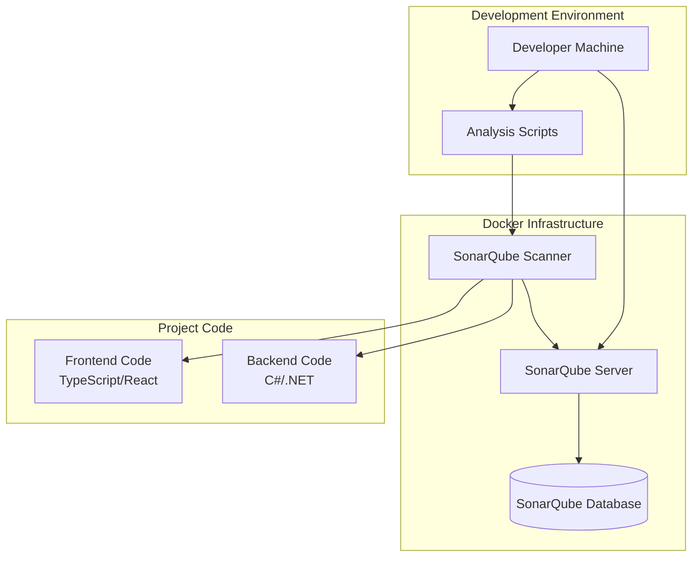

# Design Document

## Overview

Данный дизайн описывает интеграцию SonarQube в проект GeoQuiz для статического анализа кода. Решение включает настройку SonarQube сервера через Docker, конфигурацию для анализа TypeScript/React фронтенда и C#/.NET бэкенда, а также создание скриптов для ручного запуска анализа.

Архитектура решения основана на контейнеризации SonarQube с использованием существующей Docker инфраструктуры проекта и интеграции с текущей структурой проекта.

## Architecture

### Компоненты системы



### Архитектурные принципы

1. **Контейнеризация**: SonarQube развертывается как Docker контейнер для упрощения установки и управления
2. **Изоляция**: SonarQube работает в отдельной сети Docker для безопасности
3. **Персистентность**: Данные SonarQube сохраняются в Docker volumes
4. **Конфигурируемость**: Настройки анализа вынесены в отдельные конфигурационные файлы

## Components and Interfaces

### SonarQube Server
- **Назначение**: Основной сервер для анализа кода и веб-интерфейса
- **Технология**: SonarQube Community Edition в Docker контейнере
- **Порты**: 9000 (веб-интерфейс)
- **Хранилище**: PostgreSQL база данных в отдельном контейнере

### SonarQube Scanner
- **Назначение**: Клиент для сканирования кода и отправки результатов на сервер
- **Технология**: SonarScanner CLI в Docker контейнере
- **Интерфейс**: Командная строка с конфигурационными файлами

### Конфигурационные файлы

#### sonar-project.properties (Frontend)
```properties
sonar.projectKey=geoquiz-frontend
sonar.projectName=GeoQuiz Frontend
sonar.projectVersion=1.0
sonar.sources=src
sonar.exclusions=**/node_modules/**,**/*.test.ts,**/*.test.tsx,**/build/**,**/dist/**
sonar.typescript.lcov.reportPaths=coverage/lcov.info
sonar.javascript.lcov.reportPaths=coverage/lcov.info
```

#### sonar-project.properties (Backend)
```properties
sonar.projectKey=geoquiz-backend
sonar.projectName=GeoQuiz Backend
sonar.projectVersion=1.0
sonar.sources=backend/GeoQuizApi
sonar.exclusions=**/bin/**,**/obj/**,**/*.Tests/**
sonar.cs.opencover.reportsPaths=backend/coverage.opencover.xml
```

### NPM Scripts для анализа

Интеграция SonarQube анализа через npm scripts в package.json для кроссплатформенности:

#### NPM Scripts
- **npm run analyze-frontend**: Запуск анализа фронтенд кода
- **npm run analyze-backend**: Запуск анализа бэкенд кода  
- **npm run analyze-all**: Последовательный запуск анализа фронтенда и бэкенда
- **npm run sonar:start**: Запуск SonarQube сервера
- **npm run sonar:stop**: Остановка SonarQube сервера

#### Package.json интеграция
```json
{
  "scripts": {
    "sonar:start": "docker-compose up -d sonarqube sonarqube-db",
    "sonar:stop": "docker-compose down sonarqube sonarqube-db",
    "analyze-frontend": "docker run --rm -v .:/usr/src -w /usr/src --network geoquiz-network sonarsource/sonar-scanner-cli -Dsonar.projectKey=geoquiz-frontend -Dsonar.host.url=http://sonarqube:9000 -Dsonar.sources=src -Dsonar.exclusions=**/*.test.ts,**/*.test.tsx,**/node_modules/**",
    "analyze-backend": "docker run --rm -v .:/usr/src -w /usr/src --network geoquiz-network sonarsource/sonar-scanner-cli -Dsonar.projectKey=geoquiz-backend -Dsonar.host.url=http://sonarqube:9000 -Dsonar.sources=backend/GeoQuizApi -Dsonar.exclusions=**/bin/**,**/obj/**",
    "analyze-all": "npm run analyze-frontend && npm run analyze-backend"
  }
}
```

#### Преимущества NPM подхода
- **Кроссплатформенность**: Работает на Windows, macOS, Linux
- **Простота использования**: Стандартные npm команды
- **Интеграция с проектом**: Все команды в одном месте
- **Версионирование**: Команды версионируются вместе с кодом

## Data Models

### SonarQube Project Configuration
```yaml
Project:
  key: string (уникальный идентификатор)
  name: string (отображаемое имя)
  version: string (версия проекта)
  sources: array<string> (пути к исходному коду)
  exclusions: array<string> (исключения из анализа)
  language: string (основной язык проекта)
  coverage_reports: array<string> (пути к отчетам покрытия)
```

### Quality Profile Configuration
```yaml
QualityProfile:
  name: string
  language: string
  rules: array<Rule>
  
Rule:
  key: string
  severity: enum[INFO, MINOR, MAJOR, CRITICAL, BLOCKER]
  enabled: boolean
  parameters: map<string, string>
```

## Error Handling

### Ошибки конфигурации
- **Проблема**: Неверные пути к исходному коду
- **Решение**: Валидация путей перед запуском анализа
- **Логирование**: Детальные сообщения об ошибках в консоли

### Ошибки подключения
- **Проблема**: SonarQube сервер недоступен
- **Решение**: Проверка доступности сервера перед анализом
- **Retry логика**: Повторные попытки подключения с экспоненциальной задержкой

### Ошибки анализа
- **Проблема**: Ошибки компиляции или синтаксические ошибки
- **Решение**: Предварительная проверка компилируемости кода
- **Отчетность**: Детальные логи с указанием файлов и строк с ошибками

### Ошибки аутентификации
- **Проблема**: Неверные токены доступа
- **Решение**: Валидация токенов и инструкции по их получению
- **Безопасность**: Токены хранятся в переменных окружения

## Testing Strategy

### Тестирование конфигурации
- **Unit тесты**: Валидация конфигурационных файлов
- **Integration тесты**: Проверка подключения к SonarQube серверу
- **Smoke тесты**: Базовый анализ тестового кода

### Тестирование анализа
- **Функциональные тесты**: Проверка корректности анализа различных типов кода
- **Performance тесты**: Измерение времени анализа больших проектов
- **Regression тесты**: Проверка стабильности результатов анализа

### Тестирование скриптов
- **NPM script тесты**: Проверка корректности выполнения npm команд
- **Docker integration тесты**: Проверка работы SonarQube Scanner в контейнере
- **Error handling тесты**: Проверка обработки различных сценариев ошибок
- **Cross-platform тесты**: Проверка работы на Windows, macOS, Linux

### Мониторинг качества
- **Quality Gates**: Настройка пороговых значений для метрик качества
- **Trend анализ**: Отслеживание изменений качества кода во времени
- **Alerting**: Уведомления при критических проблемах качества

## Deployment Architecture

### Docker Compose Configuration
```yaml
services:
  sonarqube:
    image: sonarqube:community
    container_name: geoquiz-sonarqube
    ports:
      - "9000:9000"
    environment:
      - SONAR_JDBC_URL=jdbc:postgresql://sonarqube-db:5432/sonar
      - SONAR_JDBC_USERNAME=sonar
      - SONAR_JDBC_PASSWORD=sonar
    volumes:
      - sonarqube_data:/opt/sonarqube/data
      - sonarqube_logs:/opt/sonarqube/logs
      - sonarqube_extensions:/opt/sonarqube/extensions
    networks:
      - sonar-network
      
  sonarqube-db:
    image: postgres:13
    container_name: geoquiz-sonarqube-db
    environment:
      - POSTGRES_USER=sonar
      - POSTGRES_PASSWORD=sonar
      - POSTGRES_DB=sonar
    volumes:
      - postgresql_data:/var/lib/postgresql/data
    networks:
      - sonar-network
```

### Network Configuration
- **Изолированная сеть**: SonarQube компоненты работают в отдельной Docker сети
- **Порты**: Только веб-интерфейс (9000) доступен извне
- **Безопасность**: База данных доступна только внутри сети

### Volume Management
- **Persistent storage**: Данные SonarQube сохраняются между перезапусками
- **Backup strategy**: Регулярное резервное копирование volumes
- **Migration support**: Возможность переноса данных между средами

### Cross-Platform Integration
- **NPM Scripts**: Основной способ запуска анализа на любой платформе
- **Docker Desktop**: Требуется для работы SonarQube и Scanner контейнеров
- **Path mapping**: Автоматическое монтирование текущей директории в Docker контейнеры
- **Network connectivity**: SonarQube Scanner подключается к SonarQube серверу через Docker сеть

#### Пример использования
```bash
# Запуск SonarQube сервера
npm run sonar:start

# Анализ фронтенда
npm run analyze-frontend

# Анализ бэкенда  
npm run analyze-backend

# Анализ всего проекта
npm run analyze-all

# Остановка SonarQube
npm run sonar:stop
```