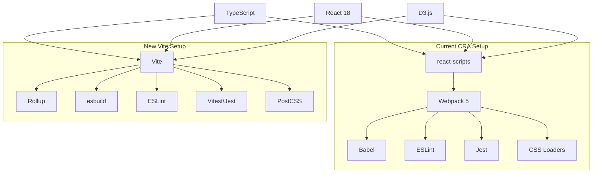

# Design Document

## Overview

This document outlines the design for migrating the React + D3.js Geo Quiz application from Create React App to Vite. The migration will modernize the build system, resolve dependency conflicts, enable updates to the latest package versions, and improve development experience while maintaining 100% functional compatibility with the existing application.

## Architecture

### Migration Strategy

The migration follows a **Big Bang** approach where we completely replace the CRA build system with Vite in a single step, rather than gradual migration. This approach is chosen because:

1. The application is relatively small and self-contained
2. No complex build customizations exist in the current CRA setup
3. Vite provides excellent compatibility with existing React/TypeScript projects
4. Risk is manageable with comprehensive testing

### Build System Comparison



### Configuration Architecture

**Vite Configuration Structure:**
```
vite.config.ts
├── Base Configuration
│   ├── TypeScript support
│   ├── React plugin
│   └── Asset handling
├── Development Configuration
│   ├── Dev server settings
│   ├── HMR configuration
│   └── Proxy settings
├── Build Configuration
│   ├── Output directory
│   ├── Asset optimization
│   └── Code splitting
└── Environment Configuration
    ├── Base path handling
    ├── Environment variables
    └── GitHub Pages compatibility
```

## Components and Interfaces

### Core Migration Components

#### Vite Configuration (`vite.config.ts`)
- **Purpose**: Central configuration for build system
- **Key Features**:
  - TypeScript compilation via esbuild
  - React JSX transformation
  - Asset processing (SVG, JSON, images)
  - Development server configuration
  - Production build optimization
- **GitHub Pages Integration**: Base path configuration for deployment

#### Package.json Updates
- **Scripts Migration**: Replace react-scripts commands with Vite equivalents
- **Dependencies**: Remove react-scripts, add Vite and related plugins
- **Dev Dependencies**: Update testing and build tools

#### Environment Variables Migration
- **Pattern Change**: `process.env.REACT_APP_*` → `import.meta.env.VITE_*`
- **Type Safety**: Add environment variable type definitions
- **Backward Compatibility**: Maintain existing environment variable functionality

### Testing Configuration

#### Test Setup Migration
- **Option 1**: Keep Jest with custom configuration
- **Option 2**: Migrate to Vitest for better Vite integration
- **Recommendation**: Start with Jest, migrate to Vitest later if needed

#### Test Environment
- **jsdom**: Maintain browser environment simulation
- **Setup Files**: Preserve existing test setup and configuration
- **Coverage**: Maintain code coverage reporting

### Asset Handling Strategy

#### Static Assets
- **Public Directory**: Maintain existing public/ structure
- **Asset Imports**: Update any direct asset imports if needed
- **SVG Handling**: Ensure map-pin.svg and other assets work correctly

#### JSON Data Files
- **GeoJSON Files**: Ensure proper import of geo.json, us.json
- **Flag Data**: Maintain countryCodes2.json import functionality
- **Type Safety**: Preserve TypeScript types for imported JSON

## Data Models

### Configuration Interfaces

```typescript
// Vite Configuration Types
interface ViteConfig {
  base: string                    // Base path for deployment
  plugins: Plugin[]              // Vite plugins array
  server: ServerOptions          // Dev server configuration
  build: BuildOptions           // Production build options
  define: Record<string, any>   // Global constants
}

// Environment Variables
interface ImportMetaEnv {
  readonly VITE_APP_VERSION: string
  readonly VITE_PUBLIC_URL: string
  // Add other environment variables as needed
}

// Migration Tracking
interface MigrationChecklist {
  configurationComplete: boolean
  dependenciesUpdated: boolean
  environmentVariablesMigrated: boolean
  testsRunning: boolean
  buildSuccessful: boolean
  deploymentWorking: boolean
}
```

### Dependency Management

**Removed Dependencies:**
- `react-scripts` - Replaced by Vite
- CRA-specific webpack loaders and plugins

**Added Dependencies:**
- `vite` - Core build tool
- `@vitejs/plugin-react` - React support
- `@types/node` - Node.js types for Vite config

**Updated Dependencies:**
- All packages to latest compatible versions
- TypeScript to 5.x
- React ecosystem packages to latest
- Material-UI to v6
- Testing libraries to latest

## Error Handling

### Migration Risk Mitigation

#### Pre-Migration Validation
- **Backup Creation**: Full project backup before starting migration
- **Dependency Audit**: Identify potential compatibility issues
- **Test Coverage**: Ensure comprehensive test coverage exists

#### Migration Process Validation
- **Step-by-Step Verification**: Validate each migration step
- **Rollback Plan**: Ability to revert to CRA if critical issues arise
- **Incremental Testing**: Test functionality after each major change

#### Post-Migration Validation
- **Functional Testing**: Comprehensive testing of all quiz modes
- **Performance Testing**: Verify build times and bundle sizes
- **Deployment Testing**: Validate GitHub Pages deployment

### Common Migration Issues

#### Import Path Issues
- **Problem**: Relative imports may need adjustment
- **Solution**: Use Vite's path resolution configuration
- **Validation**: Comprehensive import testing

#### Environment Variable Access
- **Problem**: `process.env` vs `import.meta.env`
- **Solution**: Systematic replacement with proper typing
- **Validation**: Runtime environment variable testing

#### Asset Loading Issues
- **Problem**: Public path and asset URL generation
- **Solution**: Proper base configuration for GitHub Pages
- **Validation**: Asset loading testing in production build

## Testing Strategy

### Migration Testing Phases

#### Phase 1: Configuration Testing
- **Vite Config Validation**: Ensure configuration loads without errors
- **TypeScript Compilation**: Verify all TypeScript files compile
- **Asset Resolution**: Test all asset imports and references

#### Phase 2: Development Server Testing
- **Dev Server Startup**: Verify development server starts correctly
- **Hot Module Replacement**: Test HMR functionality
- **Error Display**: Validate error reporting in development

#### Phase 3: Build Testing
- **Production Build**: Verify successful production builds
- **Bundle Analysis**: Compare bundle sizes and structure
- **Asset Generation**: Validate all assets are properly generated

#### Phase 4: Functional Testing
- **Quiz Functionality**: Test all three quiz modes thoroughly
- **Settings Persistence**: Verify localStorage functionality
- **Navigation**: Test routing and navigation
- **Visualizations**: Validate D3.js globe and map functionality

#### Phase 5: Deployment Testing
- **GitHub Pages Build**: Test deployment pipeline
- **Production Functionality**: Verify all features work in production
- **Performance Validation**: Measure and compare performance metrics

### Automated Testing Integration

#### Existing Tests
- **Preservation**: All existing Jest tests must continue to pass
- **Configuration**: Update test configuration for Vite environment
- **Coverage**: Maintain or improve test coverage metrics

#### New Migration Tests
- **Build Tests**: Automated validation of build outputs
- **Configuration Tests**: Validate Vite configuration correctness
- **Environment Tests**: Test environment variable handling

## Performance Considerations

### Development Performance

#### Build Speed Improvements
- **Cold Start**: Faster initial development server startup
- **Hot Reload**: Near-instant hot module replacement
- **TypeScript**: Faster TypeScript compilation via esbuild

#### Bundle Analysis
- **Size Comparison**: Compare CRA vs Vite bundle sizes
- **Code Splitting**: Optimize code splitting strategies
- **Asset Optimization**: Leverage Vite's built-in optimizations

### Production Performance

#### Bundle Optimization
- **Tree Shaking**: Improved dead code elimination
- **Minification**: Better minification with esbuild/Rollup
- **Compression**: Optimal asset compression strategies

#### Loading Performance
- **Preloading**: Strategic resource preloading
- **Caching**: Improved browser caching strategies
- **Lazy Loading**: Enhanced code splitting and lazy loading

## Security Considerations

### Dependency Security

#### Vulnerability Resolution
- **Audit Process**: Comprehensive security audit of new dependencies
- **Version Management**: Use latest secure versions of all packages
- **Monitoring**: Ongoing security monitoring and updates

#### Build Security
- **Source Maps**: Secure source map generation for production
- **Environment Variables**: Secure handling of sensitive configuration
- **Asset Integrity**: Maintain asset integrity and security

### Development Security

#### Development Server
- **CORS Configuration**: Proper CORS setup for development
- **Network Access**: Secure development server configuration
- **Hot Reload Security**: Secure HMR implementation

## Deployment Architecture

### GitHub Pages Compatibility

#### Base Path Configuration
- **Repository Path**: Proper base path for GitHub Pages deployment
- **Asset URLs**: Correct asset URL generation
- **Routing**: Hash routing compatibility maintenance

#### Build Pipeline
- **GitHub Actions**: Update deployment workflow if needed
- **Build Artifacts**: Ensure proper build artifact generation
- **Deployment Validation**: Automated deployment testing

### Environment Configuration

#### Development Environment
- **Local Development**: Optimized local development setup
- **Environment Variables**: Proper development environment configuration
- **Debugging**: Enhanced debugging capabilities

#### Production Environment
- **Build Optimization**: Production-optimized build configuration
- **Asset Handling**: Efficient production asset handling
- **Performance Monitoring**: Production performance tracking

## Migration Timeline

### Phase 1: Preparation (Day 1)
- Create feature branch for migration
- Backup current working state
- Install Vite and related dependencies
- Create initial Vite configuration

### Phase 2: Core Migration (Day 1-2)
- Remove react-scripts dependency
- Update package.json scripts
- Configure Vite for TypeScript and React
- Migrate environment variables

### Phase 3: Testing and Validation (Day 2-3)
- Run comprehensive test suite
- Validate all quiz functionality
- Test development and production builds
- Performance testing and optimization

### Phase 4: Deployment and Finalization (Day 3)
- Update deployment configuration
- Test GitHub Pages deployment
- Final validation and documentation
- Merge to develop branch

## Rollback Strategy

### Rollback Triggers
- Critical functionality broken
- Significant performance regression
- Deployment failures that cannot be quickly resolved
- Test failures that indicate fundamental issues

### Rollback Process
1. **Immediate**: Revert to previous commit with working CRA setup
2. **Validation**: Verify rollback restores full functionality
3. **Analysis**: Analyze migration issues for future attempt
4. **Planning**: Plan revised migration approach if needed