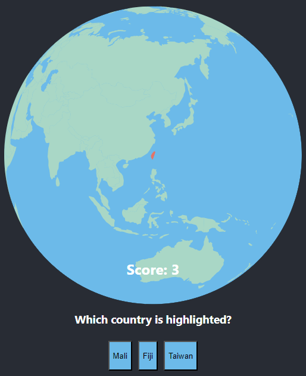

# 🌍 GeoQuiz - Interactive Geography Learning Platform

An interactive educational web application for learning world geography through engaging quiz games. Built with modern React, TypeScript, D3.js visualizations, and a robust .NET backend API.



## ✨ Features

### 🗺️ Country Quiz
- **Interactive 3D Globe**: Explore countries on a beautiful orthographic projection
- **Smart Difficulty Levels**: 
  - Easy: Worldwide selection
  - Medium: Regional grouping (continents)
  - Hard: Subregional focus
- **Visual Enhancements**: Country highlighting, borders, and location pins for small nations
- **Zoom & Pan**: Interactive globe manipulation with mouse controls

### 🏴 Flag Quiz
- **Flag Matching Game**: Connect flags with their corresponding countries
- **Batch Learning**: 5 flag-country pairs per round
- **Visual Feedback**: Instant success/error indication
- **Progressive Rounds**: Continuous learning with new flag sets

### 🇺🇸 US States Quiz
- **Detailed US Map**: Accurate Albers USA projection
- **State Recognition**: Learn all 50 US states and their locations
- **Auto-centering**: Automatic zoom to highlighted states
- **Geographic Accuracy**: Professional cartographic projections

### 👤 User Authentication & Profiles
- **Secure Registration & Login**: JWT-based authentication system
- **OAuth2 Integration**: Login with Google, Yandex, and VK
- **Profile Management**: Update personal information and preferences
- **Password Security**: Secure password change functionality
- **Session Management**: Automatic token refresh and secure logout

### 📊 Statistics & Progress Tracking
- **Comprehensive Game Statistics**: Track performance across all quiz types
- **Detailed Analytics**: View accuracy rates, best streaks, and improvement trends
- **Game History**: Browse complete history of game sessions with pagination
- **Progress Migration**: Seamlessly transfer anonymous progress to user accounts
- **Real-time Updates**: Live statistics updates after each game session

### 🏆 Leaderboards
- **Global Rankings**: Compete with players worldwide
- **Game Type Filtering**: View leaderboards for specific quiz types
- **Time Period Filters**: Compare performance over different time periods
- **Personal Ranking**: See your position among all players
- **Performance Metrics**: Rankings based on accuracy, total score, and games played

### 🌐 Internationalization

- **Bilingual Support**: Full English and Russian localization
- **Dynamic Language Switching**: Change language without page reload
- **Localized Geography**: Country names in both languages
- **Cultural Adaptation**: Region-appropriate content

### ⚙️ Customization

- **Flexible Settings**: Personalize your learning experience
- **Visual Options**: Toggle borders, pins, and zoom controls
- **Difficulty Adjustment**: Adapt challenge level to your knowledge
- **Persistent Preferences**: Settings saved both locally and on server

### 🔄 Offline Support

- **Offline Gameplay**: Continue playing without internet connection
- **Automatic Synchronization**: Sync progress when connection is restored
- **Connection Status**: Visual indicators for online/offline status
- **Data Persistence**: Local storage fallback for reliable experience

## 🛠️ Technology Stack

### Frontend
- **Framework**: React 18 with TypeScript
- **Visualizations**: D3.js for interactive maps and globe
- **UI Framework**: Material-UI (MUI) v6
- **Build System**: Vite for fast development and optimized builds
- **Routing**: React Router for seamless navigation
- **Testing**: Vitest with React Testing Library
- **Styling**: CSS with responsive design
- **Data**: GeoJSON for accurate geographic boundaries

### Backend
- **Framework**: .NET 8 Web API
- **Database**: SQLite with Entity Framework Core
- **Authentication**: JWT tokens with refresh token rotation
- **Security**: CORS, input validation, and secure password hashing
- **Architecture**: Clean architecture with dependency injection

### Static Assets Management
- **Country Flags**: Local storage of 255+ country flags in multiple sizes (~521KB total)
- **Offline Support**: All flags cached locally for better performance
- **Automatic Download**: Simple script to fetch all flags from flagcdn.com
- **Size Optimization**: Multiple flag sizes (20x15, 64x48) for different use cases
- **Fallback Support**: Automatic fallback to external CDN if local flag missing

### API Integration
- **HTTP Client**: Custom TypeScript client with automatic token management
- **Error Handling**: Comprehensive error types and recovery strategies
- **Offline Support**: Local storage fallback with automatic synchronization
- **Real-time Updates**: Optimistic UI updates with server synchronization

## 🚀 Getting Started

### Prerequisites
- **Node.js** (v16 or higher)
- **npm** or yarn
- **.NET 8 SDK** (for backend development)

### Quick Start

1. **Clone the repository**
   ```bash
   git clone https://github.com/sergeyvbo/globe-react.git
   cd globe-react
   ```

2. **Install frontend dependencies**
   ```bash
   npm install
   ```

3. **Set up environment variables**
   ```bash
   # Copy environment template
   cp .env.development .env.local
   
   # Edit .env.local with your configuration
   # VITE_API_URL=http://localhost:5000/api
   # VITE_GOOGLE_CLIENT_ID=your-google-client-id
   ```

4. **Start the backend API** (in a separate terminal)
   ```bash
   cd backend/GeoQuizApi
   dotnet run
   ```
   The API will be available at `http://localhost:5000`

5. **Download country flags** (required for flag quiz)
   ```bash
   npm run download-flags
   ```

6. **Start the frontend development server**
   ```bash
   npm start
   ```
   The app will be available at `http://localhost:3000`

### Environment Configuration

The application supports multiple environments with different configurations:

#### Development Environment
```bash
# .env.development
VITE_API_URL=http://localhost:5000/api
VITE_ENVIRONMENT=development
VITE_DEBUG=true
```

#### Production Environment
```bash
# .env.production
VITE_API_URL=http://your-production-domain/api
VITE_ENVIRONMENT=production
VITE_DEBUG=false
```

### Building for Production

```bash
# Build frontend
npm run build

# Build backend
cd backend/GeoQuizApi
dotnet publish -c Release
```

### Testing

```bash
# Run frontend tests
npm test

# Run tests in watch mode
npm run test

# Run backend tests
cd backend/GeoQuizApi.Tests
dotnet test
```

## 📁 Project Structure

```
├── src/
│   ├── Common/              # Shared utilities and types
│   │   ├── Auth/           # Authentication services and utilities
│   │   ├── config/         # API and environment configuration
│   │   ├── GeoData/        # Geographic data files (GeoJSON)
│   │   ├── types.ts        # TypeScript type definitions
│   │   ├── utils.ts        # Utility functions
│   │   └── defaults.ts     # Default configuration
│   ├── CountryQuiz/        # Country identification quiz
│   ├── FlagQuiz/           # Flag matching game
│   ├── StateQuiz/          # US states quiz
│   ├── Globe/              # 3D globe visualization component
│   ├── Quiz/               # Reusable quiz interface
│   ├── Statistics/         # User statistics and game history
│   ├── MainMenu/           # Settings and navigation
│   ├── Localization/       # Translation strings
│   └── App.tsx             # Main application component
├── backend/
│   ├── GeoQuizApi/         # .NET Web API project
│   │   ├── Controllers/    # API controllers
│   │   ├── Services/       # Business logic services
│   │   ├── Models/         # Data models and DTOs
│   │   ├── Data/           # Entity Framework context and migrations
│   │   └── Program.cs      # Application entry point
│   └── GeoQuizApi.Tests/   # Backend unit and integration tests
├── deployment/             # Deployment configuration and scripts
└── public/                 # Static assets
```

## 🌍 Geographic Data

- **World Countries**: Comprehensive GeoJSON with metadata
- **US States**: Detailed state boundaries and properties
- **Flag Data**: ISO country codes with flag image mappings
- **Multilingual Names**: Country names in multiple languages

## 🎯 Educational Value

- **Geography Learning**: Improve knowledge of world countries and US states
- **Visual Memory**: Associate flags with countries through interactive gameplay
- **Cultural Awareness**: Learn about different regions and their characteristics
- **Progressive Difficulty**: Gradual skill building from easy to challenging levels
- **Performance Tracking**: Monitor learning progress with detailed statistics
- **Competitive Learning**: Motivation through global leaderboards and rankings

## 🔒 Security Features

- **JWT Authentication**: Secure token-based authentication system
- **Password Security**: Bcrypt hashing with salt for password storage
- **Token Rotation**: Automatic refresh token rotation for enhanced security
- **CORS Protection**: Configured cross-origin resource sharing
- **Input Validation**: Comprehensive server-side and client-side validation
- **Rate Limiting**: Protection against brute force attacks

## 🔧 Development

### Available Scripts

#### Frontend
- `npm start` - Start development server
- `npm run build` - Build for production
- `npm run preview` - Preview production build
- `npm test` - Run test suite
- `npm run test:run` - Run tests once
- `npm run download-flags` - Download all country flags locally
- `npm run test-flags` - Verify all flags are downloaded
- `npm run flags-info` - Show flags storage information

#### Backend
- `dotnet run` - Start development server
- `dotnet build` - Build the project
- `dotnet test` - Run tests
- `dotnet ef migrations add <name>` - Create new migration
- `dotnet ef database update` - Apply migrations

### API Endpoints

The backend provides the following API endpoints:

#### Authentication
- `POST /api/auth/register` - User registration
- `POST /api/auth/login` - User login
- `POST /api/auth/refresh` - Refresh access token
- `GET /api/auth/me` - Get current user info
- `PUT /api/auth/profile` - Update user profile
- `PUT /api/auth/change-password` - Change password
- `POST /api/auth/logout` - Logout user

#### Game Statistics
- `POST /api/game-stats` - Save game session
- `GET /api/game-stats/me` - Get user statistics
- `GET /api/game-stats/me/history` - Get game history with pagination
- `POST /api/game-stats/migrate` - Migrate anonymous progress

#### Leaderboards
- `GET /api/leaderboard` - Get global leaderboard
- `GET /api/leaderboard/game-type/{gameType}` - Get leaderboard by game type
- `GET /api/leaderboard/period/{period}` - Get leaderboard by time period
- `GET /api/leaderboard/filtered` - Get leaderboard with combined filters

### Environment Variables

#### Frontend Environment Variables
```env
# API Configuration
VITE_API_URL=http://localhost:5000/api

# OAuth2 Configuration
VITE_GOOGLE_CLIENT_ID=your-google-client-id
VITE_YANDEX_CLIENT_ID=your-yandex-client-id
VITE_VK_CLIENT_ID=your-vk-client-id

# Application Settings
VITE_ENVIRONMENT=development
VITE_DEBUG=true
```

#### Backend Environment Variables
```env
# Database
ConnectionStrings__DefaultConnection=Data Source=geoquiz.db

# JWT Configuration
JwtSettings__SecretKey=your-secret-key
JwtSettings__Issuer=GeoQuizApi
JwtSettings__Audience=GeoQuizApp
JwtSettings__AccessTokenExpirationMinutes=15
JwtSettings__RefreshTokenExpirationDays=7

# CORS Settings
CorsSettings__AllowedOrigins__0=http://localhost:3000
CorsSettings__AllowedOrigins__1=http://localhost:5173
```

## 📱 Browser Support

- Chrome (recommended)
- Firefox
- Safari
- Edge

## 🚀 Deployment

The application uses a comprehensive Docker-based deployment system with TypeScript automation scripts. All deployment operations are managed through the `/deployment` directory.

### Prerequisites

- **Docker & Docker Compose**: Container orchestration
- **Node.js 20.6+**: For deployment scripts
- **Environment Variables**: Properly configured for each environment

### Quick Deployment

#### Using TypeScript Scripts (Recommended)

```bash
# Navigate to deployment directory
cd deployment

# Install deployment dependencies
npm install

# Deploy to different environments
npm run dev          # Development environment
npm run staging      # Staging environment  
npm run production   # Production environment

# Other deployment operations
npm run build        # Build all services
npm run health-check # Check service health
npm run db:migrate   # Run database migrations
```

#### Using Docker Compose Scripts

**Linux/macOS:**
```bash
cd deployment/docker

# Development environment
./docker-compose.sh development up -d

# Staging environment (runs on localhost:6666)
./docker-compose.sh staging up -d

# Production environment (runs on 10.66.66.64:6666)
./docker-compose.sh production up -d

# View logs
./docker-compose.sh staging logs -f

# Stop services
./docker-compose.sh staging down
```

**Windows:**
```cmd
cd deployment\docker

REM Development environment
docker-compose.bat development up -d

REM Staging environment
docker-compose.bat staging up -d

REM Production environment
docker-compose.bat production up -d

REM View logs
docker-compose.bat staging logs -f

REM Stop services
docker-compose.bat staging down
```

### Environment Configuration

#### Development Environment
- **Frontend**: `http://localhost:3000`
- **Backend**: `http://localhost:5000`
- **Database**: PostgreSQL in Docker container
- **Features**: Hot reload, detailed logging, Swagger UI enabled

#### Staging Environment
- **Frontend**: `http://localhost:6666`
- **Backend**: `http://localhost:5001`
- **Database**: PostgreSQL (staging database)
- **Features**: Production-like environment, debugging enabled

#### Production Environment
- **Frontend**: `http://10.66.66.64:6666`
- **Backend**: `http://10.66.66.64:5000` (internal)
- **Database**: PostgreSQL with persistent volumes
- **Features**: Optimized builds, security hardening, monitoring

### Deployment Architecture

The deployment system includes:

- **Multi-stage Docker builds** for optimized images
- **PostgreSQL database** with automatic migrations
- **Nginx reverse proxy** for frontend serving
- **Health checks** for all services
- **Persistent volumes** for data storage
- **Resource limits** and security configurations
- **Logging and monitoring** setup

### Service Management

#### Container Operations
```bash
# Build specific service
./docker-compose.sh staging build backend

# Restart service
./docker-compose.sh staging restart frontend

# Execute commands in container
./docker-compose.sh staging exec backend bash

# View service status
./docker-compose.sh staging ps

# Clean up environment
./docker-compose.sh staging clean
```

#### Database Operations
```bash
# Run database migrations
cd deployment
npm run db:migrate

# Access database directly
./docker-compose.sh staging exec database psql -U staging_user -d geoquiz_staging
```

### Environment Variables

Each environment uses specific configuration files:

- `deployment/environments/development.env`
- `deployment/environments/staging.env`
- `deployment/environments/production.env`

Key variables to configure:
```env
# Database
DB_PASSWORD=your_secure_password
JWT_SECRET_KEY=your_jwt_secret

# Production specific
DOMAIN_NAME=your-domain.com
FRONTEND_URL=https://your-domain.com
```

### Monitoring and Health Checks

```bash
# Check service health
cd deployment
npm run health-check

# View service logs
./docker-compose.sh production logs backend
./docker-compose.sh production logs frontend
./docker-compose.sh production logs database

# Monitor resource usage
docker stats
```

### Troubleshooting

#### Common Issues

1. **Port conflicts**: Ensure ports 5000, 5001, 6666 are available
2. **Docker daemon**: Verify Docker is running
3. **Environment variables**: Check `.env` files are properly configured
4. **Database connection**: Ensure PostgreSQL container is healthy

#### Debug Commands
```bash
# Check container status
docker ps -a

# View container logs
docker logs geoquiz-backend

# Access container shell
docker exec -it geoquiz-backend bash

# Test network connectivity
./docker-compose.sh staging exec backend ping database
```

### Security Considerations

- **Production secrets**: Use secure secret management
- **HTTPS**: Configure SSL certificates for production
- **Database**: Use strong passwords and restrict access
- **CORS**: Configure allowed origins properly
- **Container security**: Non-root users, read-only filesystems

## 🤝 Contributing

1. Fork the repository
2. Create your feature branch (`git checkout -b feature/amazing-feature`)
3. Commit your changes (`git commit -m 'Add amazing feature'`)
4. Push to the branch (`git push origin feature/amazing-feature`)
5. Open a Pull Request

### Development Guidelines
- Follow TypeScript best practices
- Write tests for new features
- Update documentation for API changes
- Ensure proper error handling
- Follow the existing code style

## 📄 License

This project is open source and available under the [MIT License](LICENSE).

## 🙏 Acknowledgments

- **D3.js Community** for powerful visualization tools
- **Natural Earth** for geographic data
- **Flag CDN** for flag images
- **React Community** for excellent documentation and tools

## 🔗 Links

- **Live Demo**: [https://sergeyvbo.github.io/globe-react/](https://sergeyvbo.github.io/globe-react/)
- **Repository**: [https://github.com/sergeyvbo/globe-react](https://github.com/sergeyvbo/globe-react)

---

Made with ❤️ for geography enthusiasts and learners worldwide
